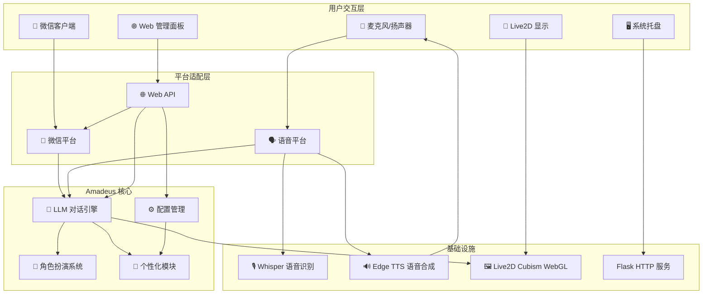
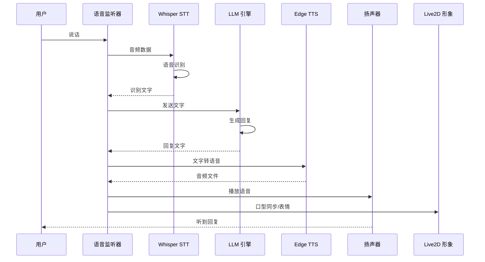
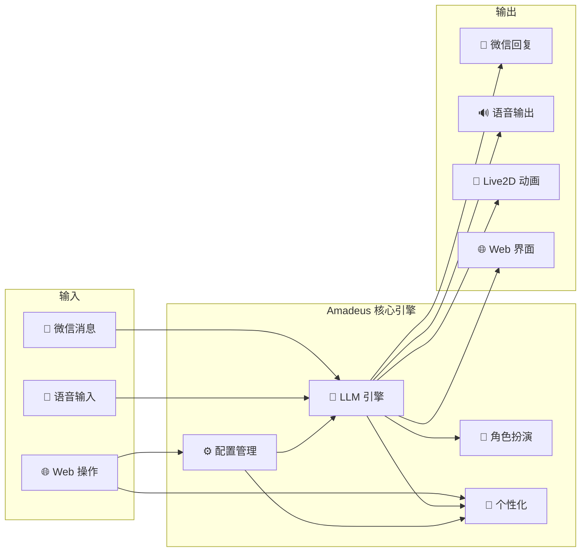

# Amadeus 项目架构重构计划

## 一、项目愿景

将当前 WeChat 自动回复助手重构为 **Amadeus** —— 一个仿照《命运石之门》中牧濑红莉栖（助手）的桌面 AI 助手项目。

### 核心能力
| 模块 | 状态 | 说明 |
|------|------|------|
| 🤖 **LLM 对话引擎** | ✅ 已有 | 多提供商支持，角色扮演（Kurisu） |
| 💬 **微信自动回复** | ✅ 已有 | uiautomation 驱动 |
| 🌐 **Web 管理面板** | ✅ 已有 | Flask + 单页前端 |
| 🗣️ **语音助手** | 🆕 新增 | 语音识别 + 语音合成 |
| 🎨 **Live2D 形象** | 🆕 新增 | Web 端 Live2D 模型渲染 |
| 🖥️ **桌面入口** | 🆕 新增 | 系统托盘 + 全局唤醒 |

---

## 二、目录结构设计

```
Amadeus/                          # 项目根目录（当前 wechat_auto_reply）
├── main.py                       # 🆕 统一入口（重构）
├── amadeus/                      # 🆕 核心包
│   ├── __init__.py
│   ├── config.py                 # 📦 从 config.py 迁移
│   ├── llm_engine.py             # 📦 从 llm_client.py 迁移 + 增强
│   ├── character_prompts.py      # 📦 从 character_prompts.py 迁移
│   └── personalization.py        # 📦 从 personalization.py 迁移
│
├── platforms/                    # 🆕 平台适配层
│   ├── __init__.py
│   ├── base.py                   # 🆕 平台基类（抽象接口）
│   ├── wechat/                   # 📦 微信模块（从根目录迁移）
│   │   ├── __init__.py
│   │   ├── monitor.py            # 📦 从 wechat_monitor.py 迁移
│   │   └── auto_reply.py         # 📦 从 auto_reply.py 迁移
│   └── voice/                    # 🆕 语音交互模块
│       ├── __init__.py
│       ├── stt.py                # 🆕 语音识别（Whisper 本地）
│       ├── tts.py                # 🆕 语音合成（Edge TTS）
│       └── listener.py           # 🆕 语音唤醒 + 持续监听
│
├── web/                          # 🆕 Web 服务层（重构 web_admin）
│   ├── __init__.py
│   ├── app.py                    # 📦 从 web_admin/app.py 迁移
│   ├── api/                      # 🆕 API 路由模块化
│   │   ├── __init__.py
│   │   ├── config.py
│   │   ├── llm.py
│   │   ├── wechat.py
│   │   ├── voice.py              # 🆕 语音控制 API
│   │   └── live2d.py             # 🆕 Live2D 控制 API
│   └── templates/
│       └── index.html            # 📦 重构，集成 Live2D + 语音面板
│
├── live2d/                       # 🆕 Live2D 模型资源
│   ├── kurisu/                   # 牧濑红莉栖模型文件
│   │   ├── kurisu.model3.json
│   │   ├── kurisu.moc3
│   │   └── textures/
│   └── README.md                 # 模型来源说明
│
├── stickers/                     # 📦 表情包资源（已有）
├── config.json                   # 📦 配置文件（已有，结构扩展）
├── config.example.json           # 📦 配置示例（已有）
├── .env                          # 📦 环境变量（已有）
├── .env.example                  # 📦 环境变量示例（已有）
├── requirements.txt              # 📦 依赖（扩展）
└── README.md                     # 📦 文档（重写）
```

---

## 三、架构分层设计



---

## 四、模块详细设计

### 4.1 语音模块 (`platforms/voice/`)

#### 语音识别 (STT) - [`platforms/voice/stt.py`](platforms/voice/stt.py)
- **方案**: OpenAI Whisper 本地模型（`faster-whisper` 或 `whisper.cpp`）
- **优势**: 完全离线，中文识别准确率高，免费
- **依赖**: `faster-whisper`（比原版 Whisper 快 4x，内存占用更低）
- **功能**:
  - 从麦克风录制音频 → 转文字
  - 支持实时流式识别（可选）
  - 支持语音活动检测（VAD），自动判断说话结束

#### 语音合成 (TTS) - [`platforms/voice/tts.py`](platforms/voice/tts.py)
- **方案**: Edge TTS（微软免费 TTS，本地调用）
- **优势**: 中文自然度高，无需 GPU，免费，延迟低
- **依赖**: `edge-tts` Python 库
- **功能**:
  - 文字 → 语音文件（WAV/MP3）
  - 选择 Kurisu 风格语音（中文自然女声）
  - 支持播放/暂停/停止控制

#### 语音监听器 - [`platforms/voice/listener.py`](platforms/voice/listener.py)
- 后台线程持续监听麦克风
- 支持唤醒词检测（可选，如"Amadeus"）
- 检测到语音后自动调用 STT → LLM → TTS 流程

#### 语音交互流程



### 4.2 Live2D 模块 (`live2d/` + Web 集成)

#### 技术方案
- **渲染引擎**: [Cubism WebGL SDK](https://www.live2d.com/sdk/download/web/)（Live2D 官方 Web SDK）
- **加载方式**: 通过 `pixi-live2d-display` 或 `live2d-loader` 在浏览器中加载
- **集成位置**: Web 管理面板中新增 Live2D 显示区域
- **交互**:
  - LLM 回复时触发口型动画
  - 鼠标悬停/点击触发互动动作
  - 空闲时随机播放待机动画

#### Live2D 模型获取
- Kurisu 的 Live2D 模型需要从以下途径获取：
  1. 同人制作的 Live2D 模型（搜索 "牧濑红莉栖 Live2D"）
  2. 使用通用 Live2D 模型 + Kurisu 风格皮肤
  3. 使用 Live2D 查看器加载已有模型文件

#### 模型文件结构
```
live2d/kurisu/
├── kurisu.model3.json    # 模型配置
├── kurisu.moc3           # 模型数据
├── textures/             # 纹理贴图
│   ├── kurisu_00.png
│   └── ...
├── motions/              # 动作文件
│   ├── idle.motion3.json
│   ├── talking.motion3.json
│   └── ...
└── expressions/          # 表情文件
    ├── happy.exp3.json
    └── ...
```

### 4.3 核心重构 - 平台抽象层

#### 平台基类 - [`platforms/base.py`](platforms/base.py)

```python
from abc import ABC, abstractmethod
from typing import Optional

class PlatformBase(ABC):
    """平台适配基类 - 所有平台（微信/语音/未来其他）实现此接口"""
    
    @abstractmethod
    def send_message(self, target: str, message: str) -> bool:
        """发送消息"""
        pass
    
    @abstractmethod
    def on_message_received(self, callback):
        """注册消息接收回调"""
        pass
    
    @abstractmethod
    def start(self):
        """启动平台监听"""
        pass
    
    @abstractmethod
    def stop(self):
        """停止平台监听"""
        pass
```

这样设计后，未来可以轻松添加：
- Telegram 平台
- Discord 平台
- QQ 平台
- 终端/TUI 交互

### 4.4 统一入口重构 - [`main.py`](main.py)

```python
# 启动模式
# python main.py                    # 默认：微信自动回复
# python main.py --voice            # 语音助手模式
# python main.py --web              # Web 管理面板模式
# python main.py --all              # 全功能模式（微信 + 语音 + Web + Live2D）
# python main.py --tray             # 系统托盘模式（后台运行）
```

---

## 五、依赖清单

### 新增依赖

| 包名 | 用途 | 大小 | 备注 |
|------|------|------|------|
| `faster-whisper` | 本地语音识别 | ~2GB（模型） | 首次运行自动下载模型 |
| `edge-tts` | 本地语音合成 | ~50MB | 无需模型下载 |
| `pyaudio` | 麦克风录音 | ~5MB | 需要 `pip install pyaudio` |
| `pystray` | 系统托盘 | ~1MB | 后台运行 |
| `pillow` | 托盘图标 | ~10MB | 已常被其他库依赖 |

### 完整 requirements.txt
```
uiautomation>=2.0.0
openai>=1.0.0
python-dotenv>=1.0.0
flask>=3.0.0
faster-whisper>=1.0.0
edge-tts>=6.0.0
pyaudio>=0.2.11
pystray>=0.19.0
pillow>=10.0.0
```

---

## 六、实施步骤

### 阶段一：项目重构（代码迁移 + 目录重组）
| # | 任务 | 说明 |
|---|------|------|
| 1 | 创建 `amadeus/` 核心包 | 迁移 config.py、llm_client.py、character_prompts.py、personalization.py |
| 2 | 创建 `platforms/` 平台层 | 创建 base.py 基类，迁移 wechat_monitor.py、auto_reply.py 到 `platforms/wechat/` |
| 3 | 重构 `web/` 服务层 | 迁移 web_admin/ 到 web/，模块化 API 路由 |
| 4 | 重构 `main.py` | 统一入口，支持多模式启动 |
| 5 | 验证微信自动回复功能正常 | 确保重构不破坏现有功能 |

### 阶段二：语音助手
| # | 任务 | 说明 |
|---|------|------|
| 6 | 安装语音依赖 | faster-whisper、edge-tts、pyaudio |
| 7 | 实现 STT 模块 | Whisper 本地语音识别 |
| 8 | 实现 TTS 模块 | Edge TTS 语音合成 |
| 9 | 实现语音监听器 | 后台线程持续监听 + 语音活动检测 |
| 10 | 语音 ↔ LLM 流程串联 | 语音输入 → 识别 → LLM 回复 → TTS 播放 |
| 11 | 语音控制 API | Web 面板可控制语音开关、音量等 |

### 阶段三：Live2D 集成
| # | 任务 | 说明 |
|---|------|------|
| 12 | 获取/准备 Live2D 模型 | Kurisu 模型文件 |
| 13 | 集成 Live2D Web SDK | 在 Web 面板中加载和渲染模型 |
| 14 | LLM 回复触发 Live2D 动画 | 说话时口型同步，表情变化 |
| 15 | Live2D 控制 API | 切换表情/动作，开关显示 |

### 阶段四：桌面体验增强
| # | 任务 | 说明 |
|---|------|------|
| 16 | 系统托盘 | 后台运行，右键菜单控制 |
| 17 | 全局唤醒快捷键 | 如 Ctrl+Alt+A 唤醒语音 |
| 18 | 开机自启 | 可选 |
| 19 | 桌面悬浮窗 | Live2D 形象独立窗口显示 |

---

## 七、数据流架构



---

## 八、Live2D Web 集成方案

### 前端技术栈
- **Live2D Cubism WebGL SDK** - 官方渲染引擎
- **pixi-live2d-display** - PixiJS 的 Live2D 插件（简化集成）
- **Canvas/WebGL** - 浏览器硬件加速渲染

### 集成方式
在 Web 管理面板的 `index.html` 中新增 Live2D 显示区域：

```html
<div id="live2d-container">
    <canvas id="live2d-canvas"></canvas>
</div>
```

### 交互功能
| 功能 | 触发条件 | 效果 |
|------|----------|------|
| 待机动画 | 空闲时 | 呼吸、眨眼、轻微晃动 |
| 说话动画 | LLM 回复时 | 口型同步、身体微动 |
| 情绪表达 | LLM 回复内容分析 | 高兴/思考/无奈等表情 |
| 鼠标交互 | 鼠标悬停/点击 | 视线跟随、触摸反应 |
| 唤醒动画 | 语音唤醒时 | 注意力转向用户 |

---

## 九、注意事项

1. **Live2D 模型版权**：Kurisu 的 Live2D 模型需要自行获取，本项目不提供版权素材
2. **Whisper 模型大小**：首次运行会下载 ~2GB 模型文件，可选择 `tiny`/`base`/`small` 等小模型
3. **Edge TTS 需要网络**：虽然是本地方案，但 Edge TTS 实际调用微软云服务，需要网络连接
4. **pyaudio 安装**：Windows 下可能需要安装 `pipwin` 或使用非官方 wheel
5. **向后兼容**：重构过程中确保现有 `config.json` 格式兼容，用户无需重新配置
