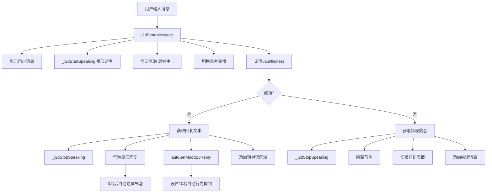

# Live2D 对话集成方案

## 概述

将 LLM 测试页面合并到 Live2D 页面，实现一个类似 ChatGPT 风格的对话界面，Amadeus 模型在回复时显示说话气泡并切换为说话状态。

---

## 一、页面布局改造

### 1.1 导航栏变更

| 当前 | 变更后 |
|------|--------|
| 🎭 Live2D | 🎭 Amadeus（不变） |
| 🧠 LLM 测试 | **移除** |

### 1.2 Live2D 页面新布局

```
┌─────────────────────────────────────┐
│ [🎭 Amadeus Live2D]  [状态切换▼]    │ ← 卡片标题栏
├─────────────────────────────────────┤
│                                     │
│          Live2D 模型区域             │
│      (高度适当缩小，给对话留空间)      │
│                                     │
│         [说话气泡 - 回复时显示]       │
├─────────────────────────────────────┤
│ ┌─────────────────────────────┐     │
│ │ 对话记录区域 (chat-box)      │     │
│ │ 用户消息 / Amadeus 回复      │     │
│ └─────────────────────────────┘     │
│ [输入框........................][发送]│
│ [↺ 重置对话]                        │
├─────────────────────────────────────┤
│ 模型信息卡片 (精简)                   │
└─────────────────────────────────────┘
```

### 1.3 布局细节

- **Live2D 容器高度**: 从 500px 缩减到 350px，给对话区域留空间
- **对话区域**: 复用现有 `.chat-box` 样式，最大高度 200px，可滚动
- **输入栏**: 复用现有 `.chat-input-row` 样式
- **模型信息卡片**: 保留但精简，只显示模型名称、当前状态

---

## 二、状态切换功能

### 2.1 状态切换按钮

在 Live2D 卡片标题栏右侧添加下拉选择器：

```html
<select id="l2dMoodSelector" onchange="l2dSetMood(this.value)">
  <option value="neutral">😐 平静</option>
  <option value="smile">😊 微笑</option>
  <option value="blush">😳 害羞</option>
  <option value="think">🤔 思考</option>
  <option value="surprise">😮 惊讶</option>
  <option value="angry">😠 生气</option>
  <option value="sad">😢 悲伤</option>
  <option value="sleepy">😴 困倦</option>
  <option value="excited">🥰 兴奋</option>
  <option value="tsundere">😤 傲娇</option>
</select>
```

### 2.2 状态切换函数

```javascript
function l2dSetMood(mood) {
    l2dExpressionPreset(mood, 0); // 0 = 持续，不自动恢复
    // 更新下拉框选中项
    document.getElementById('l2dMoodSelector').value = mood;
    // 重置自动行为计时器，避免立即覆盖
    _l2dLastInteractTime = Date.now();
}
```

---

## 三、说话状态与气泡

### 3.1 说话状态

当 Amadeus 正在回复时，模型切换为"说话"状态：

| 参数 | 值 | 效果 |
|------|-----|------|
| `ParamMouthOpenY` | 0.3~0.7 (动态变化) | 嘴巴张合 |
| `ParamMouthForm` | 0.3 | 说话嘴型 |
| `ParamEyeRSmile` | 0.3 | 微笑眼 |
| `ParamBreath` | 保持空闲动画 | 呼吸不停 |

**说话动画循环**（每 200ms 更新一次嘴部开合）：

```javascript
function _l2dStartSpeaking() {
    _l2dStopSpeaking();
    _l2dIsSpeaking = true;
    // 设置说话表情基础
    _l2dSetParam('ParamMouthForm', 0.3);
    _l2dSetParam('ParamEyeRSmile', 0.3);
    // 嘴部动态开合
    var phase = 0;
    _l2dSpeakTimer = setInterval(function() {
        if (!l2dModel || !_l2dIsSpeaking) { _l2dStopSpeaking(); return; }
        phase += 0.3;
        var open = 0.3 + Math.sin(phase * 3) * 0.2 + Math.random() * 0.1;
        _l2dSetParam('ParamMouthOpenY', Math.max(0.1, Math.min(0.8, open)));
    }, 180);
}

function _l2dStopSpeaking() {
    _l2dIsSpeaking = false;
    if (_l2dSpeakTimer) { clearInterval(_l2dSpeakTimer); _l2dSpeakTimer = null; }
    // 恢复嘴部到中性
    _l2dSetParam('ParamMouthOpenY', 0);
    _l2dSetParam('ParamMouthForm', 0);
    _l2dSetParam('ParamEyeRSmile', 0);
}
```

### 3.2 说话气泡

在 Live2D 容器内添加一个气泡元素，显示当前回复文本：

```html
<div class="l2d-speech-bubble" id="l2dSpeechBubble" style="display:none">
  <div class="l2d-speech-text" id="l2dSpeechText"></div>
</div>
```

CSS 样式：
```css
.l2d-speech-bubble {
    position: absolute;
    top: 10px;
    left: 50%;
    transform: translateX(-50%);
    max-width: 80%;
    background: var(--bg-card);
    border: 1px solid var(--border-color);
    border-radius: 12px;
    padding: 10px 16px;
    z-index: 10;
    animation: bubbleIn 0.3s ease;
    box-shadow: 0 4px 16px rgba(0,0,0,0.4);
}
.l2d-speech-bubble::after {
    content: '';
    position: absolute;
    bottom: -8px;
    left: 50%;
    transform: translateX(-50%);
    border-left: 8px solid transparent;
    border-right: 8px solid transparent;
    border-top: 8px solid var(--bg-card);
}
.l2d-speech-text {
    font-size: 13px;
    color: var(--text-primary);
    line-height: 1.5;
}
@keyframes bubbleIn {
    from { opacity: 0; transform: translateX(-50%) translateY(10px); }
    to { opacity: 1; transform: translateX(-50%) translateY(0); }
}
```

---

## 四、对话功能集成

### 4.1 对话流程

```
用户输入消息 → 点击发送/Enter
    ↓
显示用户消息在对话区域
    ↓
Amadeus 切换为"说话"状态（嘴部动画 + 气泡显示"思考中..."）
    ↓
调用 /api/llm/test 接口
    ↓
收到回复后：
  1. 停止说话状态
  2. 气泡显示回复文本（3秒后自动消失）
  3. 回复添加到对话区域
  4. 根据回复内容自动切换表情（开心→smile，疑问→think 等）
```

### 4.2 对话区域 HTML

```html
<div class="card" id="l2dChatCard">
    <div class="chat-box" id="l2dChatBox">
        <div class="empty-state"><p>与 Amadeus 对话...</p></div>
    </div>
    <div class="chat-input-row">
        <input type="text" id="l2dChatInput" placeholder="输入消息..." 
               onkeydown="if(event.key==='Enter')l2dSendMessage()">
        <button class="btn btn-primary" onclick="l2dSendMessage()">发送</button>
        <button class="btn" onclick="l2dResetChat()">↺ 重置</button>
    </div>
</div>
```

### 4.3 发送消息函数

```javascript
async function l2dSendMessage() {
    var input = document.getElementById('l2dChatInput');
    var msg = input.value.trim();
    if (!msg) return;
    
    var box = document.getElementById('l2dChatBox');
    // 移除空状态
    var empty = box.querySelector('.empty-state');
    if (empty) box.innerHTML = '';
    
    // 添加用户消息
    var um = document.createElement('div');
    um.className = 'msg user';
    um.innerHTML = '<div class="sender">你</div>' + escapeHtml(msg);
    box.appendChild(um);
    box.scrollTop = box.scrollHeight;
    input.value = '';
    input.disabled = true;
    
    // Amadeus 进入说话状态
    _l2dStartSpeaking();
    showSpeechBubble('思考中...');
    l2dExpressionPreset('think', 0);
    
    try {
        var data = await apiPost('/api/llm/test', {
            message: msg,
            contact: '用户',
            character: document.getElementById('l2dCharacter').value || 'kurisu'
        });
        
        // 停止说话状态
        _l2dStopSpeaking();
        
        var reply = data.success ? data.reply : (data.error || '请求失败');
        
        // 显示回复气泡
        showSpeechBubble(reply);
        // 3秒后隐藏气泡
        setTimeout(hideSpeechBubble, 3000);
        
        // 根据回复内容自动切换表情
        autoSetMoodByReply(reply);
        
        // 添加回复到对话区域
        var am = document.createElement('div');
        am.className = 'msg assistant';
        am.innerHTML = '<div class="sender">Amadeus</div>' + escapeHtml(reply);
        box.appendChild(am);
        box.scrollTop = box.scrollHeight;
        
    } catch(e) {
        _l2dStopSpeaking();
        hideSpeechBubble();
        l2dExpressionPreset('sad', 2000);
        
        var em = document.createElement('div');
        em.className = 'msg assistant';
        em.innerHTML = '<div class="sender" style="color:var(--accent-red)">错误</div>' + e.message;
        box.appendChild(em);
    }
    
    input.disabled = false;
    input.focus();
}
```

### 4.4 根据回复自动切换表情

```javascript
function autoSetMoodByReply(reply) {
    var text = reply.toLowerCase();
    if (text.includes('?') || text.includes('？') || text.includes('什么') || text.includes('为什么')) {
        l2dExpressionPreset('think', 3000);
    } else if (text.includes('!') || text.includes('！') || text.includes('好') || text.includes('开心')) {
        l2dExpressionPreset('smile', 3000);
    } else if (text.includes('抱歉') || text.includes('对不起') || text.includes('不好意思')) {
        l2dExpressionPreset('sad', 3000);
    } else if (text.includes('哈哈') || text.includes('笑') || text.includes('有趣')) {
        l2dExpressionPreset('excited', 3000);
    } else {
        l2dExpressionPreset('smile', 3000);
    }
}
```

### 4.5 气泡控制函数

```javascript
function showSpeechBubble(text) {
    var bubble = document.getElementById('l2dSpeechBubble');
    var textEl = document.getElementById('l2dSpeechText');
    if (bubble && textEl) {
        textEl.textContent = text;
        bubble.style.display = 'block';
    }
}

function hideSpeechBubble() {
    var bubble = document.getElementById('l2dSpeechBubble');
    if (bubble) bubble.style.display = 'none';
}
```

---

## 五、自动行为调整

### 5.1 状态切换频率降低

将自动行为间隔从 5-10 秒改为 **15-25 秒**：

```javascript
// 在 _l2dStartAutoBehavior 中
var delay = 15000 + Math.random() * 10000; // 15-25秒
```

### 5.2 对话后抑制自动行为

发送消息后，设置 10 秒的自动行为抑制期，让用户有时间看到回复效果：

```javascript
// 在 l2dSendMessage 中
_l2dUserInteractFlag = true;
if (_l2dSuppressAutoTimer) clearTimeout(_l2dSuppressAutoTimer);
_l2dSuppressAutoTimer = setTimeout(function() {
    _l2dUserInteractFlag = false;
}, 10000); // 10秒抑制
```

---

## 六、后端 API 调整

### 6.1 现有接口复用

`/api/llm/test` 接口保持不变，前端直接调用。

### 6.2 需要新增：角色选择接口

从后端获取可用角色列表（已有 `/api/config` 返回角色信息，可直接复用）。

---

## 七、实施步骤

| # | 任务 | 文件 | 说明 |
|---|------|------|------|
| 1 | 修改导航栏 | `index.html` | 移除 LLM 测试导航项 |
| 2 | 修改 Live2D 页面 HTML | `index.html` | 缩小模型容器、添加气泡、添加对话区域、添加状态切换下拉框、添加角色选择 |
| 3 | 新增 CSS 样式 | `index.html` | 说话气泡样式、状态切换下拉框样式 |
| 4 | 新增说话状态函数 | `index.html` | `_l2dStartSpeaking()` / `_l2dStopSpeaking()` |
| 5 | 新增气泡控制函数 | `index.html` | `showSpeechBubble()` / `hideSpeechBubble()` |
| 6 | 新增状态切换函数 | `index.html` | `l2dSetMood()` |
| 7 | 新增对话发送函数 | `index.html` | `l2dSendMessage()` / `l2dResetChat()` |
| 8 | 新增自动表情切换 | `index.html` | `autoSetMoodByReply()` |
| 9 | 调整自动行为间隔 | `index.html` | 15-25秒 |
| 10 | 调整对话后抑制时间 | `index.html` | 10秒 |
| 11 | 移除旧 LLM 测试页面 | `index.html` | 删除 `page-llm` 区块 |

---

## 八、架构图



---

## 九、模型参数使用确认

说话状态仅使用模型**实际支持**的参数：

| 参数 | 来源 | 说明 |
|------|------|------|
| `ParamMouthOpenY` | cdi3.json ✅ | 嘴部开合，说话核心 |
| `ParamMouthForm` | cdi3.json ✅ | 嘴型控制 |
| `ParamEyeRSmile` | cdi3.json ✅ | 微笑眼 |
| `ParamBreath` | cdi3.json ✅ | 呼吸（空闲动画持续驱动） |
| `ParamEyeBallX/Y` | cdi3.json ✅ | 眼球（可配合说话轻微移动） |

不使用 `ParamAngleX`/`ParamAngleY`（模型不支持）。
