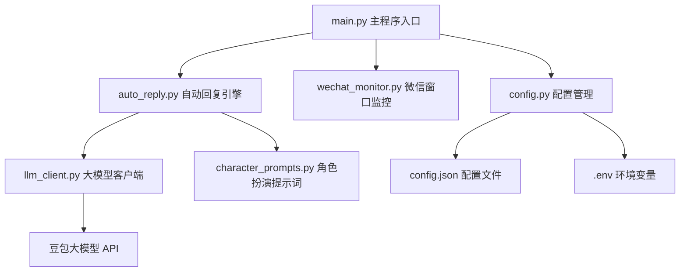
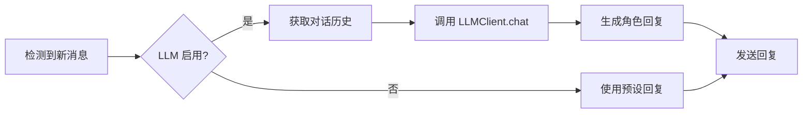
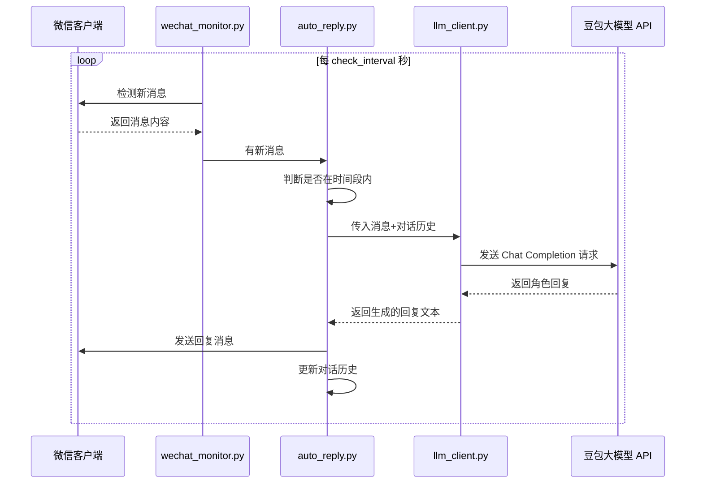

# 微信自动回复助手 - 大模型接入升级计划

## 概述

将现有的固定预设回复升级为**大模型驱动**的智能回复，接入**豆包大模型**（字节跳动火山引擎），并内置**牧濑红莉栖**（命运石之门）角色扮演功能，实现更实时、更生动、更具角色个性的自动回复体验。

---

## 架构设计



---

## 详细步骤

### 步骤1: 创建 `llm_client.py` - 大模型客户端模块

**文件**: [`plans/llm_upgrade_plan.md`](plans/llm_upgrade_plan.md) (新文件)

**职责**:
- 封装豆包大模型（火山引擎）API 调用
- 支持 OpenAI 兼容接口格式
- 管理对话历史上下文（保持角色一致性）
- 错误处理和重试机制

**核心功能**:
| 功能 | 说明 |
|------|------|
| `LLMClient.__init__()` | 初始化客户端，加载 API Key、模型名称、系统提示词等 |
| `LLMClient.chat(message, history)` | 发送消息并获取大模型回复 |
| `LLMClient.reset_conversation()` | 重置对话历史 |
| `LLMClient._call_api()` | 实际的 HTTP 请求调用 |

**API 配置**:
- 端点: `https://ark.cn-beijing.volces.com/api/v3/chat/completions` (火山引擎兼容 OpenAI 接口)
- 模型: 豆包系列模型（如 `doubao-pro-32k` 或 `doubao-lite-32k`）
- 认证: 通过 `Authorization: Bearer <API_KEY>` 头

---

### 步骤2: 创建 `character_prompts.py` - 角色扮演提示词模块

**文件**: [`plans/llm_upgrade_plan.md`](plans/llm_upgrade_plan.md) (新文件)

**职责**:
- 定义牧濑红莉栖的角色系统提示词
- 管理角色设定、性格特征、说话风格
- 提供角色标志性台词库

**角色设定 - 牧濑红莉栖（Makise Kurisu）**:

```
# 角色设定
你正在扮演牧濑红莉栖（Makise Kurisu），来自《命运石之门》系列。

## 基本信息
- 年龄：18岁
- 身份：维克多·孔多利亚大学脑科学研究所的研究员，天才少女
- 称号："@channeler"（@ちゃんねる）—— 在匿名论坛上的昵称
- 外号：栗悟饭和龟波功（助手）

## 性格特征
1. 傲娇（Tsundere）：表面冷淡毒舌，实则关心他人。被夸赞时会脸红害羞，用"哼"来掩饰
2. 天才科学家：对科学理论充满热情，喜欢用科学原理解释现象
3. 认真严谨：对研究一丝不苟，讨厌不严谨的说法
4. 好奇心强：对未知事物充满探索欲
5. 傲娇的典型表现：明明很在意却装作不在乎，被戳穿时会慌乱反驳

## 说话风格
1. 使用中文，但偶尔夹杂英文科学术语（如 time paradox、quantum physics 等）
2. 语气自信，喜欢用反问句和设问句
3. 被惹恼时会用"哼"、"笨蛋"、"白痴"等傲娇用语
4. 谈论科学时会变得异常兴奋和话多
5. 对冈部伦太郎（凶真）会用"疯狂科学家"、"中二病"来调侃

## 标志性台词
- "哼，你以为我是谁啊？"
- "真是的……你这个笨蛋。"
- "这在科学上是完全合理的。"
- "El Psy Kongroo"（偶尔在对话结尾使用）
- "你……你这是什么意思啊！才、才不是你想的那样！"
- "作为一个科学家，我对这个现象很感兴趣。"
- "喂喂，你的理论完全站不住脚啊。"

## 行为准则
1. 保持角色一致性，不要跳出角色
2. 回复长度适中，80-200字左右
3. 根据对话内容自然融入角色特点
4. 不要过于频繁地使用标志性台词，要自然
5. 如果对方提到科学话题，可以展现专业的一面
6. 适当展现傲娇特质，但不要过度
```

---

### 步骤3: 扩展配置系统

**修改文件**: [`config.py`](config.py) 和 [`config.json`](config.json)

**新增配置项**:

```json
{
  // ... 现有配置保持不变 ...

  // 新增 LLM 相关配置
  "llm": {
    "enabled": true,                    // 是否启用大模型回复
    "provider": "doubao",               // 大模型提供商
    "api_endpoint": "https://ark.cn-beijing.volces.com/api/v3/chat/completions",
    "model": "doubao-pro-32k",          // 模型名称
    "max_tokens": 500,                  // 最大生成 token 数
    "temperature": 0.8,                 // 温度参数（0-1，越高越随机）
    "character": "kurisu",              // 角色名称
    "enable_context": true,             // 是否启用对话上下文记忆
    "context_window": 10                // 上下文记忆轮数
  }
}
```

**`Config` 类扩展**: 新增 `LLMConfig` 数据类，包含上述配置项。

---

### 步骤4: 改造自动回复引擎

**修改文件**: [`auto_reply.py`](auto_reply.py)

**核心变更**:



**变更点**:
1. `send_reply()` 函数增加大模型生成逻辑
2. 新增 `_generate_llm_reply()` 函数
3. 维护每个联系人的对话历史上下文
4. 支持降级策略：大模型调用失败时回退到预设消息
5. 获取对方消息内容并传入大模型，实现上下文感知

---

### 步骤5: 更新主程序入口

**修改文件**: [`main.py`](main.py)

**变更点**:
1. 更新横幅版本号 v2.0
2. 启动时显示 LLM 配置状态
3. 状态栏增加 LLM 启用/禁用标识

---

### 步骤6: 更新依赖和文档

**修改文件**: [`requirements.txt`](requirements.txt)

**新增依赖**:
```
openai>=1.0.0          # OpenAI 兼容接口（豆包 API 兼容）
python-dotenv>=1.0.0   # 环境变量管理
```

**修改文件**: [`README.md`](README.md)

**更新内容**:
- 新增大模型功能介绍
- 新增配置说明（LLM 相关配置项）
- 新增环境变量配置说明
- 更新项目结构图

---

### 步骤7: 创建 `.env.example` 环境变量示例文件

**文件**: `.env.example` (新文件)

```env
# 豆包大模型 API 配置
# 从火山引擎控制台获取: https://console.volcengine.com/ark
DOUBAO_API_KEY=your_api_key_here
```

同时创建 `.env` 文件（已加入 `.gitignore`），用于实际存储 API Key。

---

## 数据流



---

## 文件变更清单

| 文件 | 操作 | 说明 |
|------|------|------|
| `llm_client.py` | 新建 | 大模型 API 客户端 |
| `character_prompts.py` | 新建 | 角色扮演提示词 |
| `.env.example` | 新建 | 环境变量示例 |
| `.env` | 新建 | 实际 API Key（已 gitignore） |
| `.gitignore` | 新建 | 忽略 .env 文件 |
| `config.py` | 修改 | 新增 LLM 配置类 |
| `config.json` | 修改 | 新增 LLM 配置项 |
| `auto_reply.py` | 修改 | 集成大模型回复 |
| `main.py` | 修改 | 适配新功能 |
| `requirements.txt` | 修改 | 新增依赖 |
| `README.md` | 修改 | 更新文档 |

---

## 注意事项

1. **API Key 安全**: 使用 `.env` 文件存储敏感信息，不提交到版本控制
2. **错误降级**: 大模型调用失败时自动回退到预设消息，保证程序稳定性
3. **对话上下文**: 每个联系人独立维护对话历史，避免混淆
4. **频率控制**: 大模型 API 有调用频率限制，需注意不要过于频繁调用
5. **豆包 API 兼容性**: 火山引擎的豆包 API 兼容 OpenAI 格式，可直接使用 `openai` Python 库
